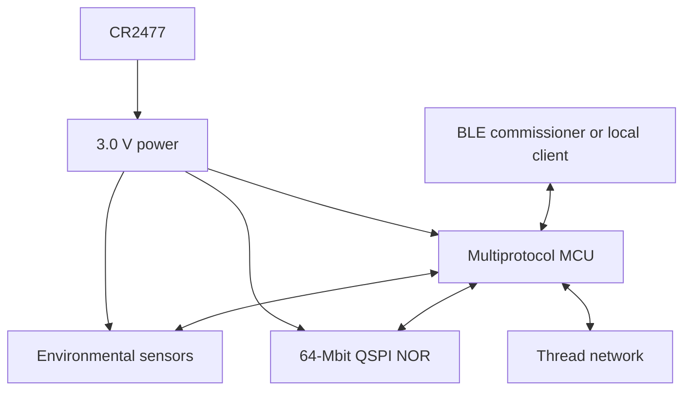
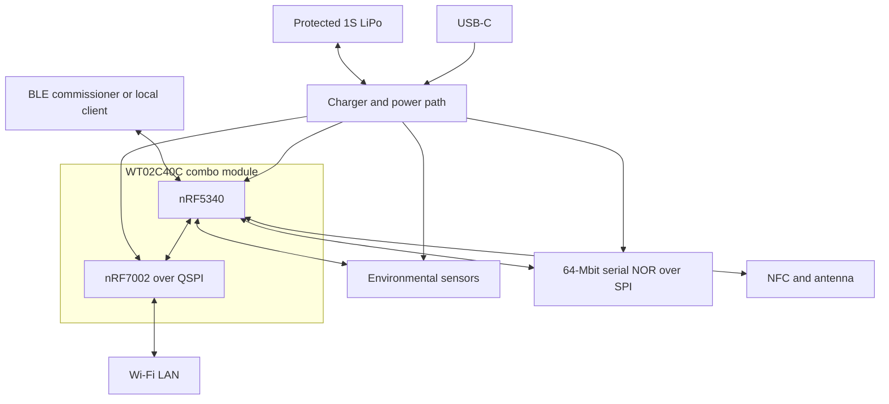

# System Architecture Document  
**Environmental Sensor Node (Rev A & Rev B)**

---

## 1. Purpose

This document defines the **high-level system architecture** for the Environmental Sensor Node project. It describes the major functional blocks, their responsibilities, and how they interact electrically, logically, and wirelessly.

The architecture is designed to:
- Support **low-power battery operation**
- Scale from **Matter-over-Thread plus BLE Local Mode (Rev A)** to **Thread + Wi-Fi + BLE Local Mode + USB power (Rev B)**
- Support **Matter and common smart-home ecosystems**
- Be suitable for **volume manufacturing and test**

Exact orderable components are maintained in the hardware block-selection record;
this document defines their architectural relationships.

---

## 2. System Overview

The device is a compact, battery-powered environmental sensor node that periodically samples environmental data and exposes it wirelessly to a smart-home ecosystem.

Two hardware revisions are planned:

- **Rev A**  
  Ultra-low-power Matter-over-Thread device with BLE commissioning and a secure,
  standalone BLE Local Mode, optimized for coin-cell operation.

- **Rev B**  
  Feature-expanded device with Wi-Fi connectivity, USB-C power, rechargeable battery support, and NFC-based onboarding.

Both revisions share a common architectural philosophy and firmware model.

---

## 3. Rev A Architecture (Matter-over-Thread, BLE Local Mode, Coin Cell)

### 3.1 High-Level Block Diagram

---

### 3.2 Functional Description

**Multiprotocol SoC / MCU**
- Central controller for all system functions
- Handles sensor polling, data aggregation, and power-state transitions
- Manages BLE commissioning, the product-specific BLE Local Mode, and Matter-over-Thread communication
- Enters deep sleep between scheduled events

**Sensors**
- Temperature / Humidity sensor via I²C  
- VOC/IAQ, pressure, and ambient-light sensors via I²C
- Battery voltage monitoring through a normally-off ADC divider

**External Memory**
- Dedicated QSPI NOR flash for secure OTA image staging
- Wear-aware circular storage for selected sensor history
- Powered continuously from the main rail and placed in deep power down between accesses

**Power System**
- Coin-cell powered
- Minimal always-on circuitry
- Baseline sensors remain powered and use their device sleep/shutdown modes
- External flash uses deep power down; no separate flash or sensor load switches
- No charging circuitry

**Wireless Operation**
- BLE is used for Matter commissioning and for a secure Local Mode that exposes sensor data and selected configuration/service functions
- BLE Local Mode is a product-specific GATT interface, not Matter-over-BLE
- Thread is the normal Matter operational transport
- A Thread Border Router and Matter controller/fabric are required for Matter-over-Thread, but neither is required for BLE Local Mode

---

### 3.3 Power Strategy

- Device uses a Matter Intermittently Connected Device or Thread Sleepy End Device profile
- Wake events:
  - Scheduled sensor sampling
  - Thread polling/reporting and commissioning activity
  - User input (button)
- Baseline sensors enter software-controlled sleep/shutdown modes between events
- Flash logging is buffered, and program/erase activity is scheduled away from BME688 heater and high-power radio events where practical

---

## 4. Rev B Architecture (BLE + Wi-Fi, USB-C, LiPo, NFC)

### 4.1 High-Level Block Diagram

---

### 4.2 Functional Description

**Multiprotocol SoC / MCU**
- Remains the system master controller
- Manages sensor polling, power domains, and state transitions
- Handles BLE commissioning, BLE Local Mode, and the selected Thread or Wi-Fi Matter configuration
- Controls Wi-Fi module power and activity
- Uses a dedicated standard SPI peripheral for external NOR flash
- The nRF5340 MCU and nRF7002 are integrated in the selected WT02C40C combo module

**Wi-Fi Subsystem**
- Provides IP connectivity for Matter over Wi-Fi
- Uses the WT02C40C internal QSPI/coexistence connection matching the nRF7002 DK arrangement
- Shares the combo-module footprint, antennas, clocks, and internal power-control circuitry with the nRF5340 host
- Enabled continuously when USB-powered
- Uses a supported associated power-save mode when battery-powered in a Matter-over-Wi-Fi build

**NFC Subsystem**
- Enables tap-to-pair and out-of-band credential exchange
- Used primarily during commissioning
- Passive when not actively scanned

**External Memory**
- Uses the same 64-Mbit serial NOR part as Rev A
- Operates in standard SPI mode because Rev B QSPI is allocated to the internal nRF7002 connection
- Stages signed OTA images and buffers selected sensor history

**Power System**
- USB-C input for continuous operation
- Single-cell LiPo battery with charging and protection
- Power-path management allows seamless switching between USB and battery
- Multiple power domains to isolate high-draw subsystems

---

### 4.3 Power Strategy

- **USB-Powered Mode**
  - Wi-Fi always available
  - Device always reachable
  - No aggressive duty cycling required

- **Battery-Powered Mode**
  - Matter-over-Thread build uses the combo module with nRF7002 hard-off or the footprint-compatible nRF5340-only population
  - Matter-over-Wi-Fi build remains associated using a supported power-save mode
  - Wi-Fi is the only hard-gateable load; baseline sensors and flash use their own low-power modes

---

## 5. Programming, Debug, and Manufacturing Support

Both revisions include:
- SWD programming access through fixture-compatible pads
- Test points for:
  - Power rails
  - Reset
  - Key communication lines
- Designed to support:
  - Firmware flashing
  - Basic RF verification
  - Sensor sanity checks
  - Automated bed-of-nails testing

Pre-v1.0 boards additionally use gender-keyed 2.54 mm current and voltage headers
for full power profiling. v1.0 and later boards replace completed development
interfaces with compact production test points as defined by the HRS.

---

## 6. Architecture Evolution Notes

- Rev B is a feature superset of Rev A
- Firmware architecture is designed to scale without rewrite
- Sensor interfaces and power domains are reusable across revisions
- BLE Local Mode remains available independently of Thread Border Router, Wi-Fi, or Matter-controller availability
- Future revisions may add additional sensors without altering the core architecture
